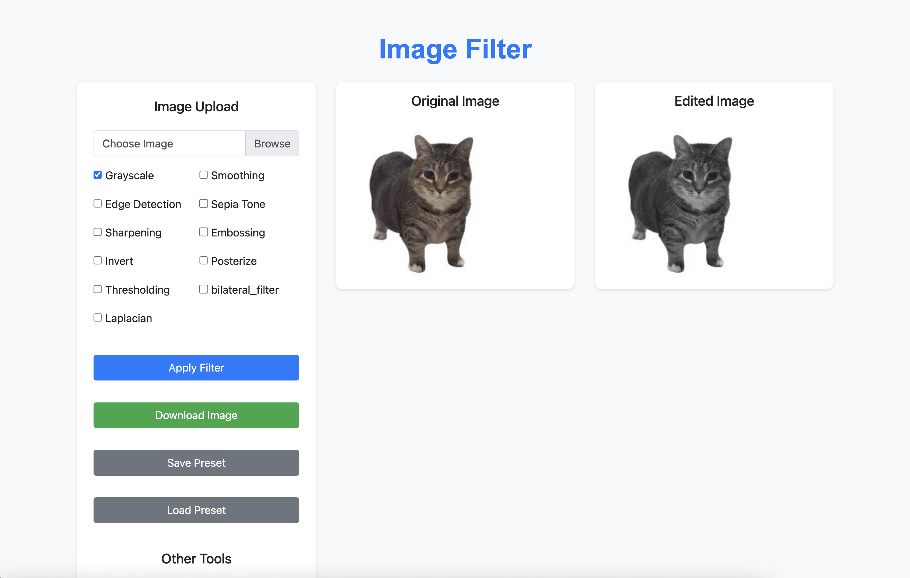
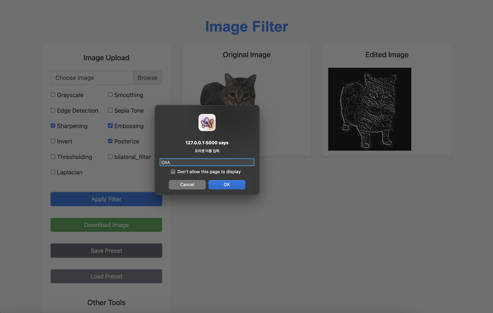

# 🖼️ 웹 기반 이미지 필터링 애플리케이션

파이썬 기반의 웹 애플리케이션으로, 사용자 친화적인 인터페이스를 통해 다양한 이미지 필터링 및 조정 기능을 제공합니다. Flask와 OpenCV를 사용하여 이미지 처리 기능을 구현하였으며, HTML, CSS, JavaScript로 프론트엔드를 구성했습니다.

## 🌟 주요 기능

- **이미지 업로드**: 로컬 장치에서 이미지를 손쉽게 업로드합니다.

- **다양한 필터 적용**:

  - 그레이스케일 (Grayscale)
  - 스무딩 (Smoothing / Blur)
  - 엣지 검출 (Edge Detection)
  - 세피아 (Sepia Tone)
  - 샤프닝 (Sharpening)
  - 엠보싱 (Embossing)
  - 색상 반전 (Invert)
  - 포스터화 (Posterize)
  - 이진화 (Thresholding)
  - 픽셀화 (Pixelate)

- **나만의 필터 프리셋**: 자주 사용하는 필터 조합을 프리셋으로 저장하고 불러올 수 있습니다.

- **노이즈 제거**:

  - 미디언 필터 (Median Filter)
  - 가우시안 필터 (Gaussian Filter)

- **이미지 조정**:

  - 밝기 (Brightness)
  - 채도 (Saturation)
  - 대비 (Contrast)

- **필터 학습 페이지 (Education Page)**:

  - 주요 필터(픽셀화, 스무딩, 샤프닝, 포스터화)의 효과를 실시간으로 비교하며 학습할 수 있습니다.
  - 각 필터의 강도를 조절하며 변화를 직접 확인할 수 있습니다.

- **실시간 미리보기**: 필터 및 조정 사항을 적용하면서 변경된 이미지를 바로 확인할 수 있습니다.

- **이미지 다운로드**: 편집된 최종 이미지를 사용자의 장치에 저장합니다.

## 🛠️ 사용 기술

- **백엔드**: Python, Flask
- **이미지 처리**: OpenCV
- **프론트엔드**: HTML, CSS, JavaScript (jQuery, Bootstrap)

## 📸 스크린샷

### 1. 메인 페이지 (필터 적용)



### 2. 나만의 필터 (프리셋 저장 및 로드)




### 3. 이미지 조정 페이지


### 4. 노이즈 제거 페이지


### 5. 필터 학습 페이지


## 🚀 실행 방법

1.  저장소를 클론합니다:
    ```bash
    git clone https://github.com/your-username/your-repository-name.git
    cd your-repository-name
    ```
2.  필요한 라이브러리를 설치합니다:
    ```bash
    pip install Flask opencv-python numpy
    ```
3.  애플리케이션을 실행합니다:
    ```bash
    python app.py
    ```
4.  웹 브라우저에서 `http://127.0.0.1:5000` 으로 접속합니다.

## 🤝 기여하기

기여는 언제나 환영합니다! 개선 사항이나 새로운 기능에 대한 아이디어가 있다면 언제든지 이슈를 생성하거나 풀 리퀘스트를 보내주세요.

---

이 프로젝트는 오픈소스 소프트웨어 개발 실습을 위해 제작되었습니다.
